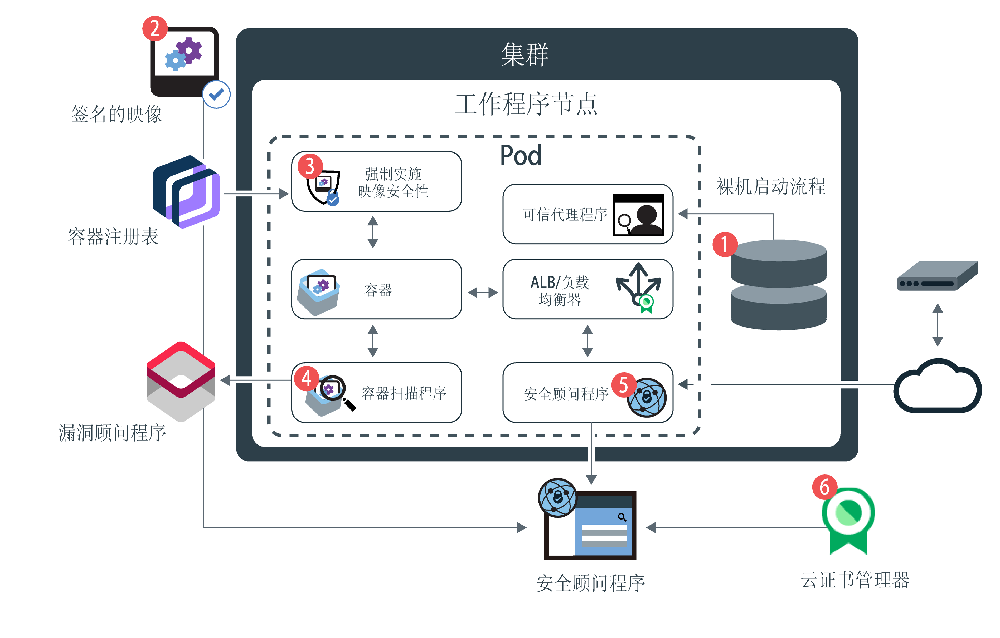

---

copyright:
  years: 2014, 2018
lastupdated: "2018-05-24"

---

{:new_window: target="_blank"}
{:shortdesc: .shortdesc}
{:screen: .screen}
{:pre: .pre}
{:table: .aria-labeledby="caption"}
{:codeblock: .codeblock}
{:tip: .tip}
{:download: .download}

# {{site.data.keyword.containerlong_notm}}的安全性
{: #security}

您可以使用 {{site.data.keyword.containerlong}} 中的内置安全功能来进行风险分析和安全保护。这些功能有助于保护 Kubernetes 集群基础架构和网络通信，隔离计算资源，以及确保基础架构组件和容器部署中的安全合规性。
{: shortdesc}

## 集群组件的安全性
{: #cluster}

每个 {{site.data.keyword.containerlong_notm}} 集群都有内置到其[主](#master)节点和[工作程序](#worker)节点的安全功能。
{: shortdesc}

如果您有防火墙，或者想要在企业网络策略阻止访问公用因特网端点时，从本地系统运行 `kubectl` 命令，那么可[在防火墙中打开端口](cs_firewall.html#firewall)。要将集群中的应用程序连接到内部部署网络或连接到集群外部的其他应用程序，请[设置 VPN 连接](cs_vpn.html#vpn)。

在下图中，可以看到按 Kubernetes 主节点、工作程序节点和容器映像分组的安全功能。

<table summary="表中的第一行跨两列。其余行应从左到右阅读，其中第一列是安全组件，第二列是要匹配的功能。">
<caption>组件的安全性</caption>
  <thead>
    <th colspan=2> {{site.data.keyword.containershort_notm}} 中的内置集群安全设置</th>
  </thead>
  <tbody>
    <tr>
      <td>Kubernetes 主节点</td>
      <td>每个集群中的 Kubernetes 主节点由 IBM 管理，具备高可用性，主节点包含 {{site.data.keyword.containershort_notm}} 安全设置，用于确保工作程序节点的安全合规性以及保护与工作程序节点之间的往来通信。IBM 会根据需要执行安全性更新。专用 Kubernetes 主节点集中控制和监视集群中的所有 Kubernetes 资源。根据集群中的部署需求和容量，Kubernetes 主节点会自动安排容器化应用程序在可用的工作程序节点之间进行部署。有关更多信息，请参阅 [Kubernetes 主节点安全性](#master)。</td>
    </tr>
    <tr>
      <td>工作程序节点</td>
      <td>容器部署在工作程序节点上；这些工作程序节点专用于集群，并确保为 IBM 客户提供计算、网络和存储隔离功能。{{site.data.keyword.containershort_notm}} 提供了内置安全性功能，以使工作程序节点在专用和公用网络上保持安全，并确保工作程序节点的安全合规性。有关更多信息，请参阅[工作程序节点安全性](#worker)。此外，可以添加 [Calico 网络策略](cs_network_policy.html#network_policies)，以进一步指定允许或阻止与工作程序节点上的 pod 之间进出的网络流量。</td>
    </tr>
    <tr>
      <td>映像</td>
      <td>作为集群管理员，您可以在 {{site.data.keyword.registryshort_notm}} 中设置自己的安全 Docker 映像存储库，在其中可以存储 Docker 映像并在集群用户之间共享这些映像。为了确保容器部署的安全，漏洞顾问程序会扫描专用注册表中的每个映像。漏洞顾问程序是 {{site.data.keyword.registryshort_notm}} 的一个组件，用于扫描以查找潜在的漏洞，提出安全性建议，并提供解决漏洞的指示信息。有关更多信息，请参阅 [{{site.data.keyword.containershort_notm}} 中的映像安全性](#images)。</td>
    </tr>
  </tbody>
</table>

 

## Kubernetes 主节点
{: #master}

查看内置 Kubernetes 主节点安全功能，以保护 Kubernetes 主节点，并保护集群网络通信安全。
{: shortdesc}

<dl>
  <dt>全面管理的专用 Kubernetes 主节点</dt>
    <dd>{{site.data.keyword.containershort_notm}} 中的每个 Kubernetes 集群都由 IBM 拥有的 IBM Cloud Infrastructure(SoftLayer) 帐户中 IBM 管理的专用 Kubernetes 主节点进行控制。Kubernetes 主节点设置有以下专用组件，这些组件不与其他 IBM 客户共享，也不由同一 IBM 帐户内的不同集群共享。
      <ul><li>etcd 数据存储器：存储集群的所有 Kubernetes 资源，例如服务、部署和 pod。Kubernetes ConfigMaps 和 Secrets 是存储为键/值对的应用程序数据，可由 pod 中运行的应用程序使用。etcd 中的数据存储在由 IBM 管理并每天备份的加密磁盘上。发送到 pod 时，数据会通过 TLS 加密以确保数据保护和完整性。</li>
      <li>kube-apiserver：充当从工作程序节点到 Kubernetes 主节点的所有请求的主入口点。kube-apiserver 会验证并处理请求，并可以对 etcd 数据存储器执行读写操作。</li>
      <li>kube-scheduler：决定 pod 的部署位置，同时考虑容量和性能需求、软硬件策略约束、反亲缘关系规范和工作负载需求。如果找不到与这些需求相匹配的工作程序节点，那么不会在集群中部署 pod。</li>
      <li>kube-controller-manager：负责监视副本集，并创建相应的 pod 以实现所需状态。</li>
      <li>OpenVPN：特定于 {{site.data.keyword.containershort_notm}} 的组件，用于为所有 Kubernetes 主节点到工作程序节点的通信提供安全的网络连接。</li></ul></dd>
  <dt>针对工作程序节点到 Kubernetes 主节点的所有通信，受到 TLS 保护的网络连接</dt>
    <dd>为了保护与 Kubernetes 主节点的连接，{{site.data.keyword.containershort_notm}} 会生成 TLS 证书，用于加密 kube-apiserver 与 etcd 数据存储器之间的通信。这些证书从不会在集群之间或在 Kubernetes 主节点组件之间进行共享。</dd>
  <dt>针对 Kubernetes 主节点到工作程序节点的所有通信，受到 OpenVPN 保护的网络连接</dt>
    <dd>虽然 Kubernetes 会使用 `https` 协议来保护 Kubernetes 主节点与工作程序节点之间的通信，但缺省情况下不会在工作程序节点上提供任何认证。为了保护此通信，在创建集群时，{{site.data.keyword.containershort_notm}} 会自动设置 Kubernetes 主节点与工作程序节点之间的 OpenVPN 连接。</dd>
  <dt>持续监视 Kubernetes 主节点网络</dt>
    <dd>每个 Kubernetes 主节点都由 IBM 持续监视，以控制进程级别的拒绝服务 (DOS) 攻击，并采取相应的补救措施。</dd>
  <dt>Kubernetes 主节点安全合规性</dt>
    <dd>{{site.data.keyword.containershort_notm}} 会自动扫描部署了 Kubernetes 主节点的每个节点，以确定是否有在 Kubernetes 中找到的漏洞，以及特定于操作系统的安全修订。如果找到了漏洞，{{site.data.keyword.containershort_notm}} 会自动代表用户应用修订并解决漏洞，以确保保护主节点。</dd>
</dl>

 

## 工作程序节点
{: #worker}

查看内置工作程序节点安全功能，这些功能用于保护工作程序节点环境，并确保资源、网络和存储器隔离。
{: shortdesc}

<dl>
  <dt>工作程序节点所有权</dt>
    <dd>工作程序节点的所有权取决于您创建的集群类型。
 免费集群中的工作程序节点将供应给 IBM 拥有的 IBM Cloud infrastructure (SoftLayer) 帐户。用户可以将应用程序部署到工作程序节点，但无法在工作程序节点上更改设置或安装额外软件。

    
标准集群中的工作程序节点将供应给与客户的公共或专用 IBM Cloud 帐户关联的 IBM Cloud infrastructure (SoftLayer) 帐户。工作程序节点由客户拥有。客户可以选择在 {{site.data.keyword.containerlong}} 提供的工作程序节点上更改安全设置或安装额外软件。
 </dd>
  <dt>计算、网络和存储基础架构隔离</dt>
    <dd>
创建集群时，IBM 会将工作程序节点作为虚拟机进行供应。工作程序节点专用于一个集群，而不托管其他集群的工作负载。

    
 每个 {{site.data.keyword.Bluemix_notm}} 帐户都设置有 IBM Cloud infrastructure (SoftLayer) VLAN，以确保工作程序节点上的高质量网络性能和隔离。您还可以通过将工作程序节点仅连接到专用 VLAN 来将其指定为专用。
 
要在集群中持久存储数据，可以从 IBM Cloud Infrastructure (SoftLayer) 供应基于 NFS 的专用文件存储器，并利用该平台的内置数据安全功能。
</dd>
  <dt>安全的工作程序节点设置</dt>
    <dd>
每个工作程序节点都由 Ubuntu 操作系统进行设置，工作程序节点所有者无法对其进行更改。由于工作程序节点的操作系统是 Ubuntu，因此部署到工作程序节点的所有容器都必须使用采用 Ubuntu 内核的 Linux 分发版。不能使用必须以其他方式与内核进行对话的 Linux 分发版。为保护工作程序节点的操作系统免受潜在攻击，每个工作程序节点都使用 Linux iptable 规则强制实施的专家防火墙设置进行配置。

    
在 Kubernetes 上运行的所有容器都通过集群创建期间在每个工作程序节点上配置的预定义 Calico 网络策略设置进行保护。此设置将确保工作程序节点与 pod 之间的安全网络通信。

    
工作程序节点上禁用了 SSH 访问权。如果您有标准集群并且要在工作程序节点上安装更多功能，那么可以对要在每个工作程序节点上运行的所有对象使用 [Kubernetes 守护程序集 ](https://kubernetes.io/docs/concepts/workloads/controllers/daemonset)。对于您必须执行的任何一次性操作，请使用 [Kubernetes 作业 ](https://kubernetes.io/docs/concepts/workloads/controllers/jobs-run-to-completion/)。
</dd>
  <dt>Kubernetes 工作程序节点安全合规性</dt>
    <dd>IBM 与内部和外部安全咨询团队合作，应对潜在的安全合规性漏洞。<b>重要信息</b>：定期（例如，每月）使用 `bx cs worker-update` [命令](cs_cli_reference.html#cs_worker_update)将更新和安全补丁部署到操作系统并更新 Kubernetes 版本。更新可用时，您在查看有关工作程序节点的信息时（例如，使用 `bx cs workers <cluster_name>` 或 `bx cs worker-get <cluster_name> <worker_ID>` 命令），会收到相应通知。</dd>
  <dt>用于在物理（裸机）服务器上部署节点的选项</dt>
    <dd>如果选择在裸机物理服务器（而不是虚拟服务器实例）上供应工作程序节点，您将对计算主机（例如，内存或 CPU）具有更多控制权。此设置无需虚拟机系统管理程序将物理资源分配给在主机上运行的虚拟机。相反，裸机机器的所有资源都仅供工作程序专用，因此您无需担心“吵闹的邻居”共享资源或降低性能。裸机服务器专供您使用，其所有资源可供集群使用。</dd>
  <dt id="trusted_compute">具有可信计算的 {{site.data.keyword.containershort_notm}}</dt>
    <dd>
[在支持可信计算的裸机上部署集群](cs_clusters.html#clusters_ui)时，可以启用信任。在集群中每个支持可信计算的裸机工作程序节点（包括未来添加到集群的节点）上，都会启用可信平台模块 (TPM) 芯片。因此，启用信任后，日后无法对集群禁用信任。信任服务器部署在主节点上，并且信任代理程序将作为 pod 部署在工作程序节点上。工作程序节点启动时，信任代理程序 pod 会监视该过程的每个阶段。

    
例如，如果未经授权的用户获得对系统的访问权，并使用其他逻辑来修改操作系统内核以收集数据，那么信任代理程序会检测到此更改并将该节点标记为不可信。通过可信计算，可以验证工作程序节点是否被篡改。

    
<strong>注</strong>：可信计算可用于精选的裸机机器类型。例如，`mgXc` GPU 类型模板不支持可信计算。
</dd>
  <dt id="encrypted_disks">加密磁盘</dt>
    <dd>
缺省情况下，{{site.data.keyword.containershort_notm}} 会为所有供应的工作程序节点提供两个本地 SSD 加密数据分区。第一个分区未加密，第二个分区安装到 _/var/lib/docker_ 并使用 LUKS 加密密钥解锁。每个 Kubernetes 集群中的每个工作程序都有自己的唯一 LUKS 加密密钥，由 {{site.data.keyword.containershort_notm}} 管理。当您创建集群或将工作程序节点添加到现有集群时，将安全地拉取密钥，然后在解锁加密磁盘后废弃。

    
<b>注</b>：加密可能会影响磁盘 I/O 性能。对于需要高性能磁盘 I/O 的工作负载，在启用和禁用加密的情况下测试集群以帮助您确定是否关闭加密。
</dd>
  <dt>对 IBM Cloud infrastructure (SoftLayer) 网络防火墙的支持</dt>
    <dd>{{site.data.keyword.containershort_notm}} 与所有 [IBM Cloud infrastructure (SoftLayer) 防火墙产品 ](https://www.ibm.com/cloud-computing/bluemix/network-security) 相兼容。在 {{site.data.keyword.Bluemix_notm}} Public 上，可以使用定制网络策略来设置防火墙，以便为标准集群提供专用网络安全性，检测网络侵入并进行补救。例如，您可以选择设置[虚拟路由器设备](/docs/infrastructure/virtual-router-appliance/about.html)以充当防火墙并阻止不需要的流量。设置防火墙时，[还必须为每个区域打开必需的端口和 IP 地址](cs_firewall.html#firewall)，以便主节点和工作程序节点可以通信。</dd>
  <dt>使服务保持专用，或者有选择地将服务和应用程序公开到公用因特网</dt>
    <dd>可以选择使服务和应用程序保持专用，并且利用内置安全功能来确保工作程序节点与 pod 之间的安全通信。要将服务和应用程序公开到公用因特网，可以利用 Ingress 和负载均衡器支持来安全地使服务公共可用。</dd>
  <dt>将工作程序节点和应用程序安全地连接到内部部署的数据中心</dt>
    <dd>
要将工作程序节点和应用程序连接到内部部署的数据中心，您可以使用 strongSwan 服务或者通过虚拟路由器设备或 FortiGate Security Appliance 来配置 VPN IPSec 端点。

    <ul><li><b>strongSwan IPSec VPN 服务</b>：您可以设置 [strongSwan IPSec VPN 服务 ](https://www.strongswan.org/)，以将 Kubernetes 集群与内部部署网络安全地连接。strongSwan IPSec VPN 服务基于业界标准因特网协议安全性 (IPsec) 协议组，通过因特网提供安全的端到端通信信道。要在集群与内部部署网络之间设置安全连接，请在集群的 pod 中直接[配置和部署 strongSwan IPSec VPN 服务](cs_vpn.html#vpn-setup)。</li>
    <li><b>虚拟路由器设备 (VRA) 或 Fortigate Security Appliance (FSA)</b>：您可选择设置 [VRA](/docs/infrastructure/virtual-router-appliance/about.html) 或 [FSA](/docs/infrastructure/fortigate-10g/about.html) 来配置 IPSec VPN 端点。如果您具有更大的集群，希望通过 VPN 来访问非 Kubernetes 资源，或者希望通过单个 VPN 访问多个集群，那么此选项会非常有用。要配置 VRA，请参阅[使用 VRA 设置 VPN 连接](cs_vpn.html#vyatta)。</li></ul></dd>

  <dt>持续监视和记录集群活动</dt>
    <dd>对于标准集群，会记录所有与集群相关的事件，然后将其发送给 {{site.data.keyword.loganalysislong_notm}} 和 {{site.data.keyword.monitoringlong_notm}}。这些事件包括添加工作程序节点、滚动更新进度或容量使用情况信息。您可以[配置集群日志记录](/docs/containers/cs_health.html#logging)和[集群监视](/docs/containers/cs_health.html#view_metrics)来决定要监视的事件。</dd>
</dl>

 

## 映像
{: #images}

使用内置安全性功能来管理映像的安全性与完整性。
{: shortdesc}

<dl>
<dt>{{site.data.keyword.registryshort_notm}} 中的安全 Docker 专用映像存储库</dt>
  <dd>可以在 IBM 托管和管理的具备高可用性和高可扩展性的多租户专用映像注册表中设置自己的 Docker 映像存储库。通过使用注册表，可以构建和安全地存储 Docker 映像，并在集群用户之间共享这些映像。
  
使用容器映像时，请了解有关[确保个人信息安全](cs_secure.html#pi)的更多信息。
</dd>
<dt>映像安全合规性</dt>
  <dd>使用 {{site.data.keyword.registryshort_notm}} 时，可以利用漏洞顾问程序提供的内置安全性扫描。对于推送到名称空间的每个映像，都会自动根据包含已知 CentOS、Debian、Red Hat 和 Ubuntu 问题的数据库进行扫描以确定是否有漏洞。如果发现了漏洞，漏洞顾问程序会提供指示信息指导如何解决这些漏洞，以确保映像完整性和安全性。</dd>
</dl>

要查看映像的漏洞评估，请[查看漏洞顾问程序文档](/docs/services/va/va_index.html#va_registry_cli)。

 

## 集群内联网
{: #in_cluster_network}

工作程序节点与 pod 之间安全的集群内网络通信可通过专用虚拟局域网 (VLAN) 来实现。VLAN 会将一组工作程序节点和 pod 视为连接到同一物理连线那样进行配置。
{:shortdesc}

创建集群时，每个集群会自动连接到一个专用 VLAN。专用 VLAN 用于确定在集群创建期间分配给工作程序节点的专用 IP 地址。

|集群类型|集群的专用 VLAN 的管理方|
|------------|-------------------------------------------|
|{{site.data.keyword.Bluemix_notm}} 中的免费集群|{{site.data.keyword.IBM_notm}}|
|{{site.data.keyword.Bluemix_notm}} 中的标准集群|您通过您的 IBM Cloud infrastructure (SoftLayer) 帐户
**提示**：要有权访问帐户中的所有 VLAN，请开启 [VLAN 生成](/docs/infrastructure/vlans/vlan-spanning.html#enable-or-disable-vlan-spanning)。
|
{: caption="专用 VLAN 的管理器" caption-side="top"}

此外，部署到一个工作程序节点的所有 pod 都会分配有一个专用 IP 地址。分配给 pod 的 IP 位于 172.30.0.0/16 专用地址范围内，并且这些 pod 仅在工作程序节点之间进行路由。为了避免冲突，请勿在与工作程序节点通信的任何节点上使用此 IP 范围。工作程序节点和 pod 可以使用专用 IP 地址在专用网络上安全地通信。但是，当 pod 崩溃或需要重新创建工作程序节点时，会分配新的专用 IP 地址。

缺省情况下，很难跟踪必须具备高可用性的应用程序不断变化的专用 IP 地址。为了避免这种情况，可以使用内置 Kubernetes 服务发现功能，并将应用程序公开为专用网络上的集群 IP 服务。Kubernetes 服务会将一些 pod 分组在一起，并提供与这些 pod 的网络连接，以供集群中的其他服务使用，而无需公开每个 pod 的实际专用 IP 地址。创建集群 IP 服务后，会从 10.10.10.0/24 专用地址范围中为该服务分配专用 IP 地址。与 pod 专用地址范围一样，请勿在与工作程序节点通信的任何节点上使用此 IP 范围。此 IP 地址只能在集群内部访问。不能从因特网访问此 IP 地址。同时，会为该服务创建 DNS 查找条目，并将该条目存储在集群的 kube-dns 组件中。DNS 条目包含服务名称、在其中创建服务的名称空间以及指向分配的专用集群 IP 地址的链接。

应用程序要访问位于集群 IP 服务后端的 pod，可以使用该服务的专用集群 IP 地址，也可以使用该服务的名称发送请求。使用服务名称时，会在 kube-dns 组件中查找该名称，并将其路由到服务的专用集群 IP 地址。请求到达服务时，服务会确保所有请求都同等转发到 pod，而不考虑其专用 IP 地址和部署到的工作程序节点。

有关如何创建类型为集群 IP 的服务的更多信息，请参阅 [Kubernetes 服务 ](https://kubernetes.io/docs/concepts/services-networking/service/#publishing-services---service-types)。

要将 Kubernetes 集群中的应用程序安全连接到内部部署网络，请参阅[设置 VPN 连接](cs_vpn.html#vpn)。要公开应用程序进行外部网络通信，请参阅[允许对应用程序进行公共访问](cs_network_planning.html#public_access)。

 

## 集群信任
{: cs_trust}

缺省情况下，{{site.data.keyword.containerlong_notm}} 提供了许多[集群组件功能](#cluster)，以便您可以在高度安全的环境中部署容器化应用程序。扩展集群中的信任级别，以更好地确保集群中发生的情况符合您的意图。可以通过各种方式在集群中实现信任，如下图中所示。
{:shortdesc}

1.  **具有可信计算的 {{site.data.keyword.containerlong_notm}}**：在裸机集群上，可以启用信任。信任代理程序会监视硬件启动过程并报告任何更改，以便您可以验证裸机工作程序节点是否被篡改。通过可信计算，可以在经过验证的裸机主机上部署容器，以便工作负载在可信硬件上运行。请注意，某些裸机机器（例如 GPU）不支持可信计算。[了解有关可信计算如何工作的更多信息](#trusted_compute)。

2.  **映像的内容信任**：通过在 {{site.data.keyword.registryshort_notm}} 中启用内容信任来确保映像的完整性。通过可信内容，可以控制谁可以将映像签名为可信。在可信签署者将映像推送到注册表之后，用户可以拉取已签名的内容，以便可以验证映像的源。有关更多信息，请参阅[对可信内容的映像签名](/docs/services/Registry/registry_trusted_content.html#registry_trustedcontent)。

3.  **Container Image Security Enforcement (beta)**：使用定制策略创建许可控制器，以便可以在部署容器映像之前验证这些映像。通过 Container Image Security Enforcement，可以控制从何处部署映像，并确保这些映像满足[漏洞顾问程序](/docs/services/va/va_index.html)策略或[内容信任](/docs/services/Registry/registry_trusted_content.html#registry_trustedcontent)需求。如果部署不满足设置的策略，那么强制实施的安全性会阻止对集群进行修改。有关更多信息，请参阅[强制实施容器映像安全性 (beta)](/docs/services/Registry/registry_security_enforce.html#security_enforce)。

4.  **容器漏洞扫描程序**：缺省情况下，漏洞顾问程序会扫描存储在 {{site.data.keyword.registryshort_notm}} 中的映像。要检查在集群中运行的实时容器的阶段状态，可以安装容器扫描程序。有关更多信息，请参阅[安装容器扫描程序](/docs/services/va/va_index.html#va_install_livescan)。

5.  **使用安全顾问程序进行网络分析（预览）**：通过 {{site.data.keyword.Bluemix_notm}} 安全顾问程序，可以从漏洞顾问程序和 {{site.data.keyword.cloudcerts_short}} 之类的 {{site.data.keyword.Bluemix_notm}} 服务集中安全性洞察。在集群中启用安全顾问程序后，可以查看有关可疑入局和出局网络流量的报告。有关更多信息，请参阅[网络分析](/docs/services/security-advisor/network-analytics.html#network-analytics)。要进行安装，请参阅[设置对 Kubernetes 集群的可疑客户机和服务器 IP 地址的监视](/docs/services/security-advisor/setup_cluster.html)。

6.  **{{site.data.keyword.cloudcerts_long_notm}} (beta)**：如果您在美国南部具有集群，并且希望[使用定制域（带 TLS）公开应用程序](https://console.bluemix.net/docs/containers/cs_ingress.html#ingress_expose_public)，那么可以将 TLS 证书存储在 {{site.data.keyword.cloudcerts_short}} 中。安全顾问程序仪表板中还会报告到期或即将到期的证书。有关更多信息，请参阅 [{{site.data.keyword.cloudcerts_short}} 入门](/docs/services/certificate-manager/index.html#gettingstarted)。

 

## 存储个人信息
{: #pi}

您负责确保 Kubernetes 资源和容器映像中个人信息的安全性。个人信息包括您的姓名、地址、电话号码或电子邮件地址，或者包括可能识别、联系或查找到您、您的客户或其他任何人的其他信息。
{: shortdesc}

<dl>
  <dt>使用 Kubernetes 私钥存储个人信息</dt>
  <dd>仅将个人信息存储在设计为保存个人信息的 Kubernetes 资源中。例如，不要在 Kubernetes 名称空间、部署、服务或配置映射的名称中使用您的姓名。为了实现妥善保护和加密，请改为在 <a href="cs_app.html#secrets">Kubernetes 私钥</a>中存储个人信息。</dd>

  <dt>使用 Kubernetes `imagePullSecret` 存储映像注册表凭证</dt>
  <dd>请勿在容器映像或注册表名称空间中存储个人信息。为了实现妥善保护和加密，请改为在 <a href="cs_images.html#other">Kubernetes ImagePullSecret</a> 中存储注册表凭证，在 <a href="cs_app.html#secrets">Kubernetes 私钥</a>中存储其他个人信息。请记住，如果个人信息存储在先前的映像层中，那么删除映像可能不足以删除这些个人信息。</dd>
  </dl>

 

